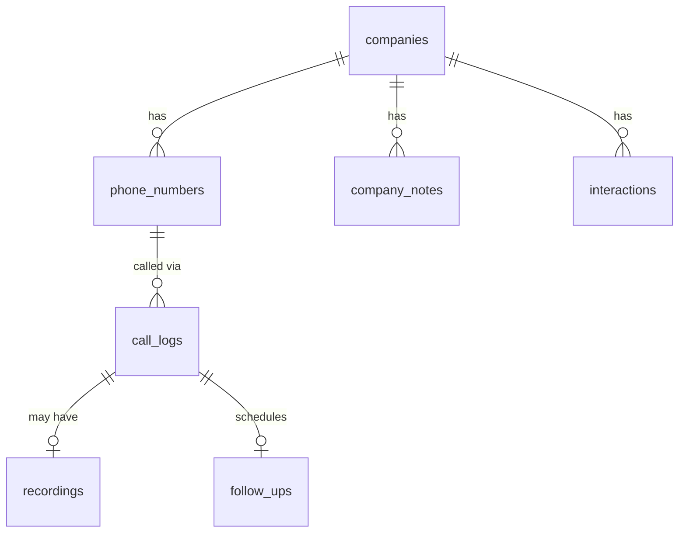

# CRM-Tableturnerr

A unified, full-stack CRM and Outreach platform designed to streamline sales operations by integrating cold call monitoring, automated transcription, multi-channel outreach (Instagram, Email, Phone), and smart follow-up management.

This monorepo contains the complete ecosystem including a modern Next.js dashboard, a shared PocketBase backend, and specialized Python tools for data capture and processing.

## 🏗️ Architecture

```
CRM-Tableturnerr/
├── apps/
│   ├── dashboard/             # 🖥️ Unified Web Interface (Next.js 15, React 19, Tailwind)
│   └── insta-outreach-agent/  # 🤖 Python desktop agent for Instagram DM automation
├── packages/
│   └── pocketbase-client/     # 📦 Shared SDK wrapper & schema definitions for PocketBase
└── tools/
    ├── audio-recorder/        # 🎙️ Desktop audio recording tool (PyQt) with hotkey support
    ├── transcriber/           # 🧠 AI Transcription service (Gemini API) for cold calls
    ├── google-maps-easy-scrape/ # 🗺️ Chrome extension for scraping restaurant leads
    └── database/              # 🗄️ Database seeding scripts
```

## 🚀 Key Features

### Core CRM
- **Company Management**: Track restaurants/businesses with multiple locations and phone numbers
- **Phone Number Labels**: Custom labels per number (Main Line, Owner Direct, Branch Name)
- **Call Logging**: Per-call notes with owner name, receptionist, outcome tracking
- **Pre-Call Research**: Notes and research organized by company

### Multi-Channel Outreach
- **Cold Calling**: Record, transcribe, and analyze calls with AI
- **Instagram DMs**: Automated outreach with status sync
- **Email**: Track email interactions in unified timeline

### Smart Follow-ups
- **Timezone-Aware**: Schedule follow-ups in client's timezone, see in your timezone
- **Auto-Reminders**: Callback outcomes auto-create follow-up tasks
- **Sidebar Clocks**: Multiple timezone clocks for quick reference

### Data Management
- **Bulk Upload**: Drag-drop recordings with auto-matching by phone number
- **Inline Editing**: Edit any field with Ctrl+Z undo and auto-save
- **Import from Google Sheets**: Bulk CSV import for legacy data

### Integrations
- **Google Maps Scraper** → Direct PocketBase upload
- **Audio Recorder** → Auto-sync recordings to dashboard
- **AI Transcription** → Built into dashboard (no Python needed)

## 📊 Data Model



| Collection | Purpose |
|------------|---------|
| `companies` | Restaurant/business entities with status tracking |
| `phone_numbers` | Per-location phone numbers with labels |
| `call_logs` | Individual call records with notes and outcomes |
| `follow_ups` | Scheduled reminders with timezone support |
| `company_notes` | Pre-call research and general notes |
| `interactions` | Unified timeline across all channels |
| `recordings` | Audio files linked to calls |

## 🛠️ Quick Start

### Prerequisites
- **Node.js** v18+ (with pnpm)
- **Python** 3.10+
- **PocketBase** v0.22+

### Install & Run

```bash
# Install dependencies
pnpm install

# Start PocketBase
pocketbase serve  # http://localhost:8090

# Import schema (Admin UI → Settings → Import Collections)
# Use: packages/pocketbase-client/pb_schema_exported.json

# Start Dashboard
cd apps/dashboard
cp .env.example .env.local
pnpm dev  # http://localhost:3000
```

## 📘 Documentation

- **[Setup Guide](SETUP_GUIDE.md)**: Detailed installation and deployment
- **[Upcoming Features](UPCOMING.md)**: Planned enhancements
- **Data Schema**: `packages/pocketbase-client/pb_schema_exported.json`

## 🧩 Components

### Dashboard (`apps/dashboard`)
Next.js 15 web app with:
- Company detail pages with tabbed interface
- Inline editing with undo support
- Bulk recording upload with preview
- Timezone clocks in sidebar

### Transcriber (`tools/transcriber`)
Python service using Gemini AI to:
- Transcribe call recordings
- Extract owner/receptionist names
- Identify call outcomes and follow-up needs

### Audio Recorder (`tools/audio-recorder`)
PyQt desktop app with:
- Global hotkey recording (Alt+R)
- Auto-naming with timestamp and phone number
- One-click save workflow

### Google Maps Scraper (`tools/google-maps-easy-scrape`)
Chrome extension for:
- Scraping restaurant listings from Maps
- Quick-add overlay on business pages
- CSV export or direct PocketBase upload

## 📄 License

MIT