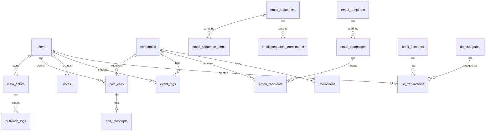

# CRM-Tableturnerr

> **AI Context**: A full-stack sales CRM monorepo for restaurant owner outreach, combining cold calling with audio transcription, Instagram DM automation, and lead scraping tools—all backed by a self-hosted PocketBase database.

---

## 🎯 What This Project Does

**Domain**: B2B restaurant SaaS sales  
**Problem Solved**: Managing multi-channel outreach (phone, Instagram, email) for selling SaaS to restaurant owners  
**Target Users**: Sales teams performing cold calls and social media outreach

### Core Workflows
1. **Lead Acquisition** → Scrape restaurants from Google Maps or Instagram
2. **Cold Calling** → Record calls, auto-transcribe with AI, track outcomes
3. **Instagram Outreach** → Automated DM campaigns via actor accounts
4. **Email Marketing** → Campaigns, sequences, templates, A/B testing, analytics
5. **Financial Tracking** → Bank accounts, transactions, budgets, cash flow
6. **Pipeline Management** → Track status from Cold → Warm → Booked → Client
7. **System Audio Recording** → Capture full system audio for desktop app calls

---

## 🏗️ Repository Structure

```
CRM-Tableturnerr/
├── apps/
│   ├── dashboard/                 # 🖥️ Next.js 15 web interface (main CRM UI)
│   │   ├── src/app/(dashboard)/   # Route groups: companies, cold-calls, leads, etc.
│   │   ├── src/components/        # Reusable UI components
│   │   └── src/lib/               # PocketBase client, utilities
│   │
│   └── insta-outreach-agent/      # 🤖 Python desktop agent for Instagram DM automation
│       └── src/                   # Browser automation scripts
│
├── packages/
│   ├── pocketbase-client/         # 📦 Shared TypeScript SDK with type definitions
│   │   ├── src/index.ts           # CRMPocketBase class + all collection types
│   │   └── pb_db_schema.json # Full database schema (source of truth)
│   │
│   ├── google-sheets/             # 📊 Google Sheets API integration utilities
│   └── hubspot/                   # 🔗 HubSpot CRM migration context & mapping
│
├── tools/
│   ├── TT-lead-scraper-extension/ # 🗺️ Chrome extension for Google Maps lead scraping
│   │   ├── manifest.json          # Extension config (Manifest V3)
│   │   ├── popup.js               # Extension popup logic
│   │   └── background.js          # Service worker
│   │
│   ├── audio-recorder/            # 🎙️ PyQt desktop app with hotkey recording
│   │   ├── recorder.py            # Main GUI application
│   │   └── installer.nsi          # NSIS installer script
│   │
│   ├── call-recorder-v2/          # 🎤 .NET/WPF call recording application
│   │
│   ├── transcriber/               # 🧠 Gemini AI transcription service
│   │   ├── transcribe_calls.py    # Main transcription script
│   │   └── pocketbase_service.py  # DB integration
│   │
│   ├── database/                  # 🗄️ Seeding and migration scripts
│   │
│   └── discord-bot/               # 🤖 Discord DM notification bot
│       ├── src/index.ts           # Entry — boots client, auths PB, starts scheduler
│       ├── src/scheduler.ts       # Cron jobs for due/overdue follow-ups
│       └── src/notifications/    # Follow-up and alert polling logic
│
└── [Root Config Files]
    ├── package.json               # pnpm workspace root
    ├── pnpm-workspace.yaml        # Workspace package definitions
    ├── SETUP_GUIDE.md             # Detailed setup instructions
    └── .env.info.example          # Environment variable reference
```

---

## 🔧 Technology Stack

| Layer | Technology | Version |
|-------|------------|---------|
| **Frontend** | Next.js | 15.x |
| | React | 19.x |
| | Tailwind CSS | 4.x |
| | Lucide Icons | Latest |
| **Backend** | PocketBase | 0.22+ |
| | SQLite | (built into PocketBase) |
| **AI/ML** | Google Gemini API | gemini-2.5-flash |
| **Integrations** | Zoom Phone Smart Embed | Latest |
| **Desktop Tools** | Python | 3.10+ |
| | PyQt6 | (audio recorder GUI) |
| | PyInstaller | (Windows executables) |
| **Browser Extension** | Chrome Manifest V3 | |
| **Package Manager** | pnpm | 9.x |

---

## 📊 Data Model (PocketBase Collections)


```mermaid
erDiagram
    users ||--o{ insta_actors : "owns"
    users ||--o{ cold_calls : "claims"
    users ||--o{ notes : "creates"
    users ||--o{ event_logs : "triggers"
    users ||--o{ fin_transactions : "creates"

    companies ||--o{ cold_calls : "receives"
    companies ||--o{ event_logs : "has"
    companies ||--o{ email_recipients : "receives"
    companies ||--o{ interactions : "has"

    cold_calls ||--o| call_transcripts : "has"

    insta_actors ||--o{ outreach_logs : "sends"

    email_campaigns ||--o{ email_recipients : "targets"
    email_sequences ||--o{ email_sequence_steps : "contains"
    email_sequences ||--o{ email_sequence_enrollments : "enrolls"
    email_templates ||--o{ email_campaigns : "used_by"

    bank_accounts ||--o{ fin_transactions : "has"
    fin_categories ||--o{ fin_transactions : "categorizes"
```

### Collection Reference

**CRM Core:**

| Collection | Purpose | Key Fields |
|------------|---------|------------|
| `users` | Team members | `name`, `email`, `role` (admin/operator/member), `status` |
| `companies` | Restaurant entities | `company_name`, `owner_name`, `phone_numbers`, `status`, `source` |
| `cold_calls` | Call records | `company`, `call_outcome`, `interest_level`, `phone_number`, `claimed_by` |
| `call_transcripts` | AI transcriptions | `call` (relation), `transcript` |
| `cold_calling_sessions` | Live session state | Session tracking for cold calling workflow |
| `interactions` | Multi-channel activity | `company`, `channel`, `direction`, `notes` |
| `follow_ups` | Scheduled follow-ups | `company`, `due_date`, `status`, `notes` |
| `notes` | Rich text notes | `title`, `note_text` (Tiptap JSON), `is_archived`, `is_deleted` |
| `recordings` | Call recordings | Audio file storage and metadata |
| `phone_numbers` | Phone directory | Phone number management |
| `insta_actors` | Instagram accounts | `username`, `owner` (relation), `status` (Active/Suspended) |
| `event_logs` | Audit trail | `event_type`, `actor`, `user`, `company`, `source` |
| `outreach_logs` | Message tracking | `event` (relation), `message_text`, `sent_at` |
| `goals` | KPI targets | `metric`, `target_value`, `frequency`, `status` |
| `rules` | Rate limiting | `type`, `metric`, `limit_value`, `time_window_sec` |
| `alerts` | Notifications | `target_user`, `entity_type`, `message`, `is_dismissed` |

**Email Marketing:**

| Collection | Purpose | Key Fields |
|------------|---------|------------|
| `email_campaigns` | Campaign orchestration | `name`, `template`, `status`, `audience_list`, `counters` |
| `email_templates` | Reusable email designs | `name`, `subject`, `html_body`, `json_body`, `category` |
| `email_lists` | Audience segments | `name`, `list_type` (static/dynamic/suppression), `filter_json` |
| `email_recipients` | Per-recipient send status | `campaign`, `company`, `status`, `tracking_id`, `open_count` |
| `email_sequences` | Drip campaign definitions | `name`, `status`, `trigger_type`, `trigger_config` |
| `email_sequence_steps` | Steps within a sequence | `sequence`, `step_order`, `template`, `delay_days` |
| `email_sequence_enrollments` | Per-company enrollment | `sequence`, `company`, `status`, `current_step` |
| `email_events` | Granular event log | `recipient`, `event_type`, `event_data` |
| `email_unsubscribes` | Suppression registry | `company`, `email_address`, `reason`, `source` |

**Financial:**

| Collection | Purpose | Key Fields |
|------------|---------|------------|
| `bank_accounts` | Bank account tracking | Account details and balances |
| `balance_adjustments` | Manual balance corrections | Adjustment records |
| `fin_categories` | Transaction categories | Category hierarchy |
| `fin_transactions` | Financial transactions | `bank_account`, `type`, `amount`, `category`, `status`, `date` |
| `recurring_transactions` | Recurring entries | Scheduled recurring transaction rules |

> **Schema Location**: `packages/pocketbase-client/pb_db_schema.json` (35+ collections total)

---

## 🖥️ Component Details

### Dashboard (`apps/dashboard`)
Modern Next.js 15 web application with:
- **Route Groups**: `(dashboard)/` contains all authenticated routes
  - `/companies` - Company CRUD with inline editing and hierarchy support
  - `/cold-calls` - Call log with transcript viewer and recording download
  - `/session` - Live cold calling session with power dialer
  - `/session-logs` - Session history with CSV export
  - `/email` - Email marketing (campaigns, templates, lists, sequences, analytics)
  - `/financial` - Financial tracking (accounts, transactions, budgets, cash flow)
  - `/follow-ups` - Scheduled follow-up management
  - `/leads` - Lead management
  - `/actors` - Instagram actor management
  - `/recordings` - Bulk audio upload
  - `/notes` - Rich text notes (Tiptap block editor)
  - `/goals` - KPI tracking
  - `/settings` - App configuration
  - `/team` - User management

- **Key Components**:
  - `sidebar.tsx` - Navigation with timezone clocks
  - `inline-edit-field.tsx` - Inline editing with Ctrl+Z undo
  - `bulk-upload-modal.tsx` - Drag-drop recording upload
  - `column-selector.tsx` - Table column visibility
  - `zoom-call-button.tsx` - Click-to-call via Zoom Phone
  - `zoom-phone-context.tsx` - Zoom Phone state management
  - `power-dialer-panel.tsx` - Automated sequential dialing from a queue
  - `block-editor/` - Tiptap 3 rich text editor with slash commands
  - `email/` - 18 email marketing components (campaign builder, sequence builder, template editor, etc.)
  - `financial/` - Financial dashboard components (cash flow charts, expense breakdowns, transaction management)

- **Zoom Phone Integration**:
  - Embedded Smart Embed dialer with postMessage API
  - **Refined UI**: Minimized circular button with dynamic call status coloring
  - **Active Session**: Always-visible session banner
  - Auto-dial setting to route calls through Zoom desktop app
  - Auto-record calls setting for automatic recording
  - Native dialer toggle for switching between custom and Zoom dialers
  - Call status tracking (idle, ringing, connected, ended)
  - Configurable via Settings → Integrations

### Audio Recorder (`tools/audio-recorder`)
PyQt6 desktop application:
- **Hotkey**: Alt+R for quick recording
- **System Audio**: Captures entire screen audio for desktop app calls
- **Auto-naming**: Timestamps + phone number
- **Build**: PyInstaller → NSIS installer
- **Entry Point**: `recorder.py`

### Transcriber (`tools/transcriber`)
Python service for AI transcription:
- **AI Model**: Gemini 2.5 Flash
- **Extracts**: Transcript, owner name, call outcome, follow-up needs
- **Entry Point**: `transcribe_calls.py`
- **Requires**: `GEMINI_API_KEY` environment variable

### Discord Bot (`tools/discord-bot`)
Node.js/TypeScript background worker:
- **Follow-up reminders**: DMs the assigned user when a follow-up is due (blue embed)
- **Overdue alerts**: DMs the assigned user for any past-due pending follow-ups every 30 min (yellow embed)
- **User preferences**: Respects per-user DND windows and notification toggle stored in `user_preferences` collection
- **Auth**: Admin PocketBase auth with automatic token refresh on 401
- **Entry Point**: `src/index.ts`

### Lead Scraper Extension (`tools/TT-lead-scraper-extension`)
Chrome extension (Manifest V3) for Google Maps restaurant scraping:
- **Modes**: Automated list scraping, Manual single-add with overlay
- **Features**: CRM integration, dark mode, keyboard shortcuts, auto-connect
- **Output**: Direct PocketBase upload or CSV export

---

## 🤖 AI Agent Onboarding

### Key Files to Read First
1. `packages/pocketbase-client/src/index.ts` - All TypeScript types and SDK methods
2. `packages/pocketbase-client/pb_db_schema.json` - Database schema
3. `apps/dashboard/src/app/(dashboard)/layout.tsx` - Dashboard structure
4. `.env.info.example` - All environment variables

### Common Modification Patterns
- **Add new page**: Create folder in `apps/dashboard/src/app/(dashboard)/`
- **Add new collection**: Update `pb_db_schema.json`, add types to `pocketbase-client/src/index.ts`
- **Add component**: Create in `apps/dashboard/src/components/`

### Where to Find Things
| Looking for... | Location |
|----------------|----------|
| TypeScript types | `packages/pocketbase-client/src/index.ts` |
| Database schema | `packages/pocketbase-client/pb_db_schema.json` |
| UI components | `apps/dashboard/src/components/` |
| Page routes | `apps/dashboard/src/app/(dashboard)/` |
| API utilities | `apps/dashboard/src/lib/` |
| Environment vars | `.env.info.example` |

---

## ⚙️ Configuration Reference

### Environment Variables

```bash
# PocketBase (all Python tools + dashboard)
POCKETBASE_URL=http://localhost:8090        # Local dev
NEXT_PUBLIC_POCKETBASE_URL=http://localhost:8090  # Dashboard browser

# PocketBase Admin (server-side tools only)
PB_ADMIN_EMAIL=admin@example.com
PB_ADMIN_PASSWORD=your_password

# Gemini AI (transcriber only)
GEMINI_API_KEY=your_api_key
GEMINI_MODEL=gemini-2.5-flash

# Discord bot (tools/discord-bot only)
DISCORD_BOT_TOKEN=your_bot_token
CRM_BASE_URL=https://crm.tableturnerr.com
POLL_INTERVAL_MINUTES=5
```

### Zoom Phone Settings (localStorage)

Zoom Phone integration settings are stored in the browser's localStorage:

- `zoom-phone-autodial` - Auto-dial through Zoom desktop app (default: `false`)
- `call-recorder-auto-mode` - Auto-record calls (default: `true`)
- `zoom-show-native-dialer` - Show native dialer toggle (default: `false`)

These can be configured via **Settings → Integrations → Zoom Phone**.

### Service URLs
| Service | Local | Production |
|---------|-------|------------|
| PocketBase API | `http://localhost:8090` | `https://api.yourdomain.com` |
| Dashboard | `http://localhost:3000` | `https://app.yourdomain.com` |
| PocketBase Admin | `http://localhost:8090/_/` | `https://api.yourdomain.com/_/` |

---

## 🚀 Quick Start

```bash
# 1. Install dependencies
pnpm install

# 2. Start PocketBase
pocketbase serve  # http://localhost:8090

# 3. Import schema (Admin UI → Settings → Import Collections)
# Use: packages/pocketbase-client/pb_db_schema.json

# 4. Start Dashboard
cd apps/dashboard
cp .env.example .env.local
pnpm dev  # http://localhost:3000
```

> **Detailed Setup**: See [SETUP_GUIDE.md](SETUP_GUIDE.md)

---

## 🧪 Automated Testing

The dashboard has a full **Playwright E2E test suite** (127 tests across 12 files).

```bash
cd apps/dashboard

# First-time setup
cp .env.test.example .env.test   # fill in credentials
npx playwright install chromium

# Run all tests
pnpm test

# Smoke tests only (~2 min)
pnpm test -- --grep @smoke

# Interactive UI mode
pnpm test:ui

# Live call tests (real Zoom Phone calls to public test lines)
# Set TEST_LIVE_CALLS=true in .env.test first
pnpm test:headed tests/12-live-call-flow.spec.ts
```

Test coverage: auth, overview, companies, cold calls, session lifecycle, session logs, notes, actors, recordings, settings, and cross-component integration flows.

> **Full test docs**: [`apps/dashboard/tests/README.md`](apps/dashboard/tests/README.md)

---

## 📘 Related Documentation

| Document | Purpose |
|----------|---------|
| [SETUP_GUIDE.md](SETUP_GUIDE.md) | Detailed installation, seeding, and deployment |
| [packages/hubspot/HUBSPOT_CONTEXT.md](packages/hubspot/HUBSPOT_CONTEXT.md) | HubSpot CRM migration mapping |

---

## 📄 License

MIT