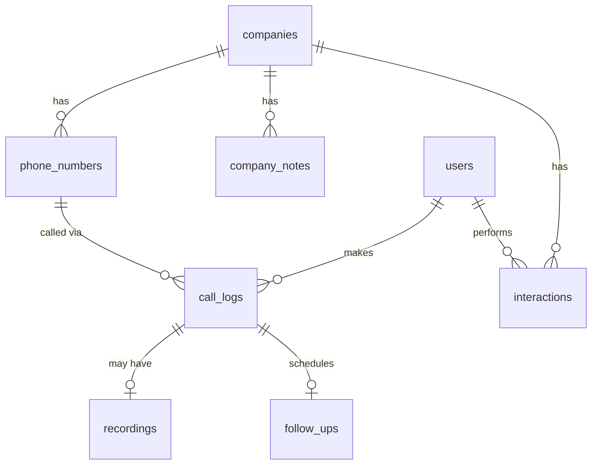

# CRM System Enhancement - Finalized Discussion

## Executive Summary

This document outlines the comprehensive upgrade to the CRM-Tableturnerr system, affecting the dashboard, database schema, and integration with existing tools (audio recorder, transcriber, google maps scraper).

---

## Finalized Requirements (From Your Feedback)

### ✅ Confirmed Decisions

| Area | Decision |
|------|----------|
| **Multi-location companies** | One entity, one status, one owner — but receptionists vary by location |
| **Phone numbers** | Separate collection with custom labels (e.g., "Leads to owner") + suggested labels |
| **Call-Recording relationship** | 1 recording = 1 call, but calls can exist without recordings |
| **Notes per call** | Each call has its own notes (owner, receptionist, post-call notes) — all optional |
| **Multiple calls to same number** | Separate entries; most recent shown first |
| **Company detail view** | Both unified timeline AND location-specific sections |
| **Inline editing** | All table fields editable with undo (Ctrl+Z), localStorage persistence, save to sync |
| **Follow-up reminders** | Store in client's timezone, convert to user's timezone for alerts |
| **Timezone clocks** | Display multiple timezone clocks in sidebar |
| **Multi-channel** | Support calls, Instagram DMs, and emails — both unified and separate views |

---

## Updated Database Schema

### New Collections



#### `phone_numbers` (NEW)
| Field | Type | Required | Description |
|-------|------|----------|-------------|
| `id` | text (auto) | ✓ | Primary key |
| `company` | relation → companies | ✓ | Parent company |
| `phone_number` | text | ✓ | The actual number |
| `label` | text | | Custom label ("Main", "Owner Direct", "Brooklyn") |
| `location_name` | text | | Location/branch name |
| `location_address` | text | | Full address of location |
| `receptionist_name` | text | | Last known receptionist at this number |
| `last_called` | datetime | | When this number was last called |
| `created` | autodate | ✓ | |
| `updated` | autodate | ✓ | |

**Suggested labels (UI dropdown):** `Main Line`, `Owner Direct`, `Manager`, `Brooklyn`, `Manhattan`, etc. + custom input

---

#### `call_logs` (NEW - replaces cold_calls for new workflow)
| Field | Type | Required | Description |
|-------|------|----------|-------------|
| `id` | text (auto) | ✓ | Primary key |
| `company` | relation → companies | ✓ | Company called |
| `phone_number_record` | relation → phone_numbers | ✓ | Specific number called |
| `caller` | relation → users | | Team member who made call |
| `call_time` | datetime | ✓ | When the call was made |
| `duration` | number | | Call length in seconds |
| `call_outcome` | select | | Interested/Not Interested/Callback/No Answer/Wrong Number/Other |
| `owner_name_found` | text | | Owner name discovered during call |
| `receptionist_name` | text | | Receptionist talked to (updates phone_number record) |
| `post_call_notes` | text | | Notes after the call |
| `interest_level` | number (1-10) | | How interested were they |
| `status_changed_to` | select | | If company status was updated |
| `has_recording` | bool | | Whether a recording exists |
| `created` | autodate | ✓ | |
| `updated` | autodate | ✓ | |

---

#### `follow_ups` (NEW)
| Field | Type | Required | Description |
|-------|------|----------|-------------|
| `id` | text (auto) | ✓ | Primary key |
| `call_log` | relation → call_logs | ✓ | Origin call |
| `company` | relation → companies | ✓ | For quick access |
| `scheduled_time` | datetime | ✓ | When to follow up (in client timezone) |
| `client_timezone` | text | ✓ | IANA timezone (e.g., "America/New_York") |
| `assigned_to` | relation → users | | Who should follow up |
| `notes` | text | | Follow-up context |
| `status` | select | ✓ | pending/completed/dismissed |
| `completed_at` | datetime | | When marked complete |
| `created` | autodate | ✓ | |

---

#### `recordings` (MODIFIED)
| Field | Type | Required | Description |
|-------|------|----------|-------------|
| `id` | text (auto) | ✓ | Primary key |
| `call_log` | relation → call_logs | | Link to specific call (optional for manual uploads) |
| `company` | relation → companies | | Direct company link |
| `phone_number_record` | relation → phone_numbers | | Which number was called |
| `phone_number` | text | | Raw phone from filename (for matching) |
| `file` | file | ✓ | The audio file |
| `recording_date` | datetime | | Extracted from filename |
| `duration` | number | | Length in seconds |
| `uploader` | relation → users | | Who uploaded |
| `created` | autodate | ✓ | |
| `updated` | autodate | ✓ | |

> **Note removed**: Recording notes are now handled via `call_logs.post_call_notes`

---

#### `company_notes` (NEW - for pre-call research)
| Field | Type | Required | Description |
|-------|------|----------|-------------|
| `id` | text (auto) | ✓ | Primary key |
| `company` | relation → companies | ✓ | Parent company |
| `phone_number_record` | relation → phone_numbers | | Location-specific notes |
| `note_type` | select | ✓ | "pre_call", "research", "general" |
| `content` | text | ✓ | The note content |
| `created_by` | relation → users | ✓ | Author |
| `created` | autodate | ✓ | |

---

#### `interactions` (NEW - unified channel tracking)
| Field | Type | Required | Description |
|-------|------|----------|-------------|
| `id` | text (auto) | ✓ | Primary key |
| `company` | relation → companies | ✓ | Company |
| `channel` | select | ✓ | "phone", "instagram", "email" |
| `direction` | select | ✓ | "outbound", "inbound" |
| `timestamp` | datetime | ✓ | When interaction occurred |
| `user` | relation → users | | Team member |
| `summary` | text | | Brief summary |
| `call_log` | relation → call_logs | | For phone interactions |
| `created` | autodate | ✓ | |

---

## UI Changes Overview

### Company Detail Page (New Design)

```
┌─────────────────────────────────────────────────────────────┐
│ 🏢 Pizza Palace                              Status: [Warm ▼]│
│ Owner: John Smith                             [Edit] [Save] │
│ @pizzapalace_nyc • pizza@example.com                        │
├─────────────────────────────────────────────────────────────┤
│ [📍 Locations] [📞 All Calls] [📋 Notes] [📊 Timeline]      │
├─────────────────────────────────────────────────────────────┤
│ 📍 Phone Numbers / Locations                                │
│ ┌─────────────────────────────────────────────────────────┐ │
│ │ 📞 (718) 555-1234                                       │ │
│ │ Label: [Owner Direct ▼]  Location: Brooklyn Branch      │ │
│ │ Receptionist: Maria    Last Called: Jan 20, 2026        │ │
│ │ ─────────────────────────────────────────────────────── │ │
│ │ 📝 Calls to this number (3)                             │ │
│ │ • Jan 20 - Callback | Notes: "Will call next week"      │ │
│ │ • Jan 15 - No Answer                                    │ │
│ │ • Jan 10 - Interested | 🎙️ Recording                    │ │
│ │                                         [+ Log Call]    │ │
│ └─────────────────────────────────────────────────────────┘ │
│ ┌─────────────────────────────────────────────────────────┐ │
│ │ 📞 (212) 555-9999                                       │ │
│ │ Label: [Main Line ▼]    Location: Manhattan             │ │
│ │ Never Called                                            │ │
│ │                                         [+ Log Call]    │ │
│ └─────────────────────────────────────────────────────────┘ │
│                                    [+ Add Phone Number]     │
├─────────────────────────────────────────────────────────────┤
│ 📋 Pre-Call Research Notes                                  │
│ • "They post on IG every Tuesday - best time to DM"         │
│ • "Owner's wife manages Brooklyn location"                  │
│                                         [+ Add Note]        │
├─────────────────────────────────────────────────────────────┤
│ ⏰ Pending Follow-Ups                                       │
│ ┌─────────────────────────────────────────────────────────┐ │
│ │ Jan 28, 2026 @ 2:00 PM EST (10:00 AM your time)         │ │
│ │ From call on Jan 20: "Call back about lunch menu"       │ │
│ │                              [Complete] [Reschedule]    │ │
│ └─────────────────────────────────────────────────────────┘ │
└─────────────────────────────────────────────────────────────┘
```

### Sidebar Timezone Clocks

```
┌─────────────────────┐
│ 🕐 Time Zones       │
│ ─────────────────── │
│ EST   2:45 PM       │
│ PST   11:45 AM      │
│ UTC   7:45 PM       │
│ [+ Add Timezone]    │
└─────────────────────┘
```

### Inline Editing with Undo

- Click any field to edit inline
- `Ctrl+Z` to undo changes
- Changes stored in localStorage until saved
- Explicit "Save" button syncs to database
- Visual indicator for unsaved changes

---

## System-Wide Changes by Component

### 1. Dashboard (`apps/dashboard`)

| Area | Changes Required |
|------|------------------|
| **Database types** | Add `PhoneNumber`, `CallLog`, `FollowUp`, `CompanyNote`, `Interaction` interfaces |
| **Companies page** | Complete redesign with phone number management, call history per number |
| **Recordings page** | Link recordings to call_logs, remove standalone notes field |
| **New components** | `PhoneNumberCard`, `CallLogForm`, `FollowUpAlert`, `TimezoneClock`, `InlineEdit` |
| **Sidebar** | Add timezone clocks section at bottom |
| **Tables** | Standardize all tables with consistent columns, pagination, search |
| **State management** | Implement localStorage persistence for unsaved edits |

### 2. Audio Recorder (`tools/audio-recorder`)

| Area | Changes Required |
|------|------------------|
| **File naming** | Already includes timestamp + phone number ✓ |
| **Phone validation** | Already sanitizes to digits only ✓ |
| **New feature** | Option to enter location label during save |
| **API integration** | POST to new `/api/recordings` endpoint that auto-matches company |

### 3. Transcriber (`tools/transcriber`)

| Area | Changes Required |
|------|------------------|
| **Output mapping** | Update to create `call_logs` instead of `cold_calls` |
| **Prompt update** | Add extraction for receptionist name |
| **Follow-up detection** | If transcript mentions callback, auto-create `follow_up` record |
| **Recording linking** | Link transcribed recording to the created `call_log` |

### 4. Google Maps Scraper (`tools/google-maps-easy-scrape`)

| Area | Changes Required |
|------|------------------|
| **Phone handling** | Support multiple phone numbers per business |
| **Address capture** | Capture full address for `phone_numbers.location_address` |
| **Export format** | Update to match new schema structure |
| **API integration** | Direct POST to PocketBase instead of Google Sheets (optional) |

### 5. Insta Outreach Agent (`apps/insta-outreach-agent`)

| Area | Changes Required |
|------|------------------|
| **Interaction logging** | Create `interactions` with channel="instagram" |
| **Company linking** | Match by `instagram_handle` to link interactions |
| **Unified timeline** | DM events appear in company timeline |

### 6. PocketBase Client (`packages/pocketbase-client`)

| Area | Changes Required |
|------|------------------|
| **Schema export** | Update `pb_schema_exported.json` with new collections |
| **TypeScript types** | Add types for new collections |
| **Migrations** | Create migration scripts for schema changes |

---

## Color Palette & UI Consistency

| Element | Color |
|---------|-------|
| Background | `#000000` (pure black) or `#0a0a0a` (near-black) |
| Text | `#ffffff` (pure white) |
| Cards | `#111111` - `#1a1a1a` |
| Borders | `#2a2a2a` - `#333333` |
| Success | `#22c55e` (green) - small accents only |
| Warning | `#f59e0b` (orange) - small accents only |
| Error | `#ef4444` (red) - small accents only |
| Info | `#3b82f6` (blue) - small accents only |

### Table Consistency Checklist
- [ ] Consistent padding (py-3 px-4)
- [ ] Same hover state (bg-[var(--sidebar-bg)])
- [ ] Column selector on all tables
- [ ] Unified search bar design
- [ ] Same pagination controls (25, 50, 100 per page)
- [ ] Matching row height and typography
- [ ] Consistent action buttons styling

---

## Security Hardening

| Risk | Mitigation |
|------|------------|
| **XSS in notes** | Sanitize with DOMPurify before rendering |
| **Filter injection** | Escape user input in PocketBase filter strings |
| **Sensitive data** | Audit console.log statements, remove credentials |
| **Session security** | Token refresh mechanism, logout on suspicious activity |
| **File uploads** | Already limited to 100MB with type validation ✓ |
| **CORS** | Restrict to allowed origins in PocketBase config |

---

## Next Steps

After you approve this plan, I will:

1. **Create migration scripts** for new database collections
2. **Update TypeScript types** in `packages/pocketbase-client`
3. **Implement UI components** starting with:
   - Company detail page redesign
   - Phone number management
   - Call logging interface
   - Inline editing with undo
4. **Add timezone support** to sidebar
5. **Update transcriber** to work with new schema
6. **Security audit** across all components

---

## ✅ All Questions Answered

| Question | Answer |
|----------|--------|
| Phone labels | Current list is fine (Main Line, Owner Direct, Manager, Branch Name) |
| Timezone detection | Use company location/address |
| Legacy data | Discard current PocketBase data; use bulk upload for old Google Sheets data |
| Bulk upload UI | Both: simple drag-drop AND preview table with toggle |

---

## 💡 Comprehensive Suggestions for Team-Stack

### 1. Google Maps Scraper → Direct PocketBase Integration

**Current**: Exports to Google Sheets/CSV  
**Suggested**: Direct API upload to PocketBase

| Feature | Description |
|---------|-------------|
| **One-click upload** | After scraping, "Upload to CRM" button sends directly to PocketBase |
| **Auto-create phone numbers** | Parse multiple phone numbers, create separate `phone_numbers` records |
| **Duplicate detection** | Check by phone number or Google Maps URL before adding |
| **Pre-fill location** | Auto-populate `phone_numbers.location_address` from Maps data |
| **Batch confirmation** | Preview scraped leads before uploading, deselect unwanted ones |

### 2. Dashboard: Built-in Transcription

**Current**: Separate Python tool (`tools/transcriber`)  
**Suggested**: Transcribe directly from dashboard

| Feature | Description |
|---------|-------------|
| **Upload & transcribe** | When uploading recording, option to "Transcribe with AI" |
| **Server-side processing** | Next.js API route calls Gemini, avoids Python dependency |
| **Real-time progress** | Show transcription status with progress indicator |
| **Edit transcript** | Allow manual corrections before saving |
| **Auto-fill call log** | Pre-populate owner name, receptionist, summary from transcript |

### 3. Audio Recorder → Deeper Integration

**Current**: Saves files locally, requires manual upload  
**Suggested**: Auto-sync to dashboard

| Feature | Description |
|---------|-------------|
| **Watch folder sync** | Dashboard watches for new recordings in designated folder |
| **Auto-upload on save** | Recorder POSTs to dashboard API endpoint |
| **Company pre-selection** | Before recording, search and select company from CRM |
| **One-click workflow** | Start recording → End → Auto-upload → Transcribe → Done |

### 4. Instagram Outreach Agent → Unified CRM

**Current**: Separate Python agent with own database interactions  
**Suggested**: Full CRM integration

| Feature | Description |
|---------|-------------|
| **DM history in timeline** | All DMs appear in company's interaction timeline |
| **Status sync** | If lead replies on IG, auto-update company status to "Replied" |
| **Template library** | Store DM templates in PocketBase, editable from dashboard |
| **Follow-up from DM** | Create follow-up reminder when DM indicates callback needed |

### 5. Dashboard Analytics & Reporting

**Current**: Basic stats  
**Suggested**: Comprehensive analytics

| Feature | Description |
|---------|-------------|
| **Team leaderboard** | Calls made, leads converted, follow-ups completed per user |
| **Conversion funnel** | Visual: Cold → Replied → Warm → Booked → Paid → Client |
| **Time analysis** | Best times to call (by outcome success rate) |
| **Channel comparison** | Which channel (call/IG/email) converts better |
| **Daily/weekly reports** | Auto-generate summary emails to team |

### 6. Smart Follow-Up System

**Current**: Manual tracking  
**Suggested**: Intelligent reminders

| Feature | Description |
|---------|-------------|
| **Auto-schedule** | If outcome="Callback", auto-create follow-up for next day |
| **Escalation** | Overdue follow-ups escalate to manager |
| **Time zone aware** | Show "It's 2pm in New York" when following up |
| **Snooze options** | Quick snooze: 1 hour, tomorrow, next week |
| **Batch follow-ups** | "Do all EST follow-ups during lunch" view |

### 7. Lead Scoring & Prioritization

**Current**: Manual status tracking  
**Suggested**: Automatic scoring

| Feature | Description |
|---------|-------------|
| **Interest score** | Combine: interest_level + engagement + recency |
| **Hot leads queue** | Dashboard widget showing highest-priority leads to call |
| **Decay algorithm** | Score decreases if no contact in X days |
| **Multi-signal** | Boost score if: replied on IG + answered call + visited website |

### 8. Email Integration

**Current**: Email field exists, no tracking  
**Suggested**: Full email outreach

| Feature | Description |
|---------|-------------|
| **Send from dashboard** | Compose emails directly, auto-log interaction |
| **Templates** | Store email templates with variables ({company_name}, {owner_name}) |
| **Track opens/clicks** | Integrate with email tracking service |
| **Sequence automation** | Multi-step email sequences with delays |

### 9. Mobile-Friendly Dashboard

**Current**: Desktop-focused  
**Suggested**: Mobile optimization

| Feature | Description |
|---------|-------------|
| **Responsive tables** | Card view on mobile, table on desktop |
| **Quick actions** | Swipe gestures for common actions |
| **Click-to-call** | Phone numbers are tappable links |
| **Offline mode** | Cache recent data for field work |

### 10. Browser Extension for Instagram Prospecting

**From UPCOMING.md**: Extension to scrape Instagram profiles  
**Enhanced suggestion**:

| Feature | Description |
|---------|-------------|
| **Profile scraper** | One-click add lead from Instagram profile |
| **Business info** | Pull website, phone, category from IG business profile |
| **Direct CRM save** | POST to PocketBase, skip Google Sheets |
| **Duplicate check** | "Already in CRM" indicator on profiles |
| **Quick notes** | Add pre-call notes right from the extension |

### 11. Bulk Operations Hub

**New**: Dedicated bulk operations page

| Feature | Description |
|---------|-------------|
| **CSV import** | Upload Google Sheets export, map columns to schema |
| **Recording batch** | Drop folder of recordings, auto-match all |
| **Bulk status update** | Select 50 leads → Change status to "Excluded" |
| **Duplicate finder** | Scan database for potential duplicates |
| **Data cleanup** | Find leads missing phone numbers, incomplete data |

### 12. Keyboard Shortcuts Throughout Dashboard

| Shortcut | Action |
|----------|--------|
| `Ctrl+K` | Global search |
| `Ctrl+N` | New company |
| `Ctrl+S` | Save current changes |
| `Ctrl+Z` | Undo last change |
| `J/K` | Navigate up/down in tables |
| `E` | Edit selected row |
| `Esc` | Cancel / Close modal |

---

## Implementation Priority (Suggested)

| Priority | Items |
|----------|-------|
| **P0 - Core** | Database schema, Company detail page, Inline editing, Bulk upload |
| **P1 - Integration** | Google scraper → PocketBase, Dashboard transcription |
| **P2 - UX** | Timezone clocks, Follow-up system, Keyboard shortcuts |
| **P3 - Analytics** | Leaderboard, Funnel, Time analysis |
| **P4 - Future** | Mobile, Email integration, Lead scoring |

---

## Next Steps

Ready to create the detailed **implementation plan** with:
- Exact migration scripts
- File-by-file changes
- Verification steps

Approve to proceed!

